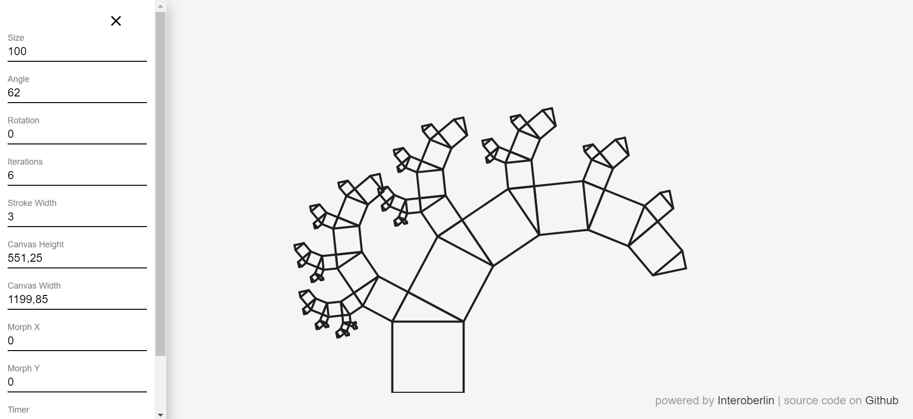

# Pythagoras Tree

This project lets you create a pythagoras tree which repeatedly refreshes with randomly set parameters. You can modify the parameters by using the menu options.

Visit [this project's Github pages](https://interoberlin.github.io/pythagoras-tree-ng/) for a live demo.



## Running the application

Since this is an Angular application you need NodeJS to be installed in order to run this app locally.

Run run following commands to start the app using lite-server

```
npm run install
npm run start
```
